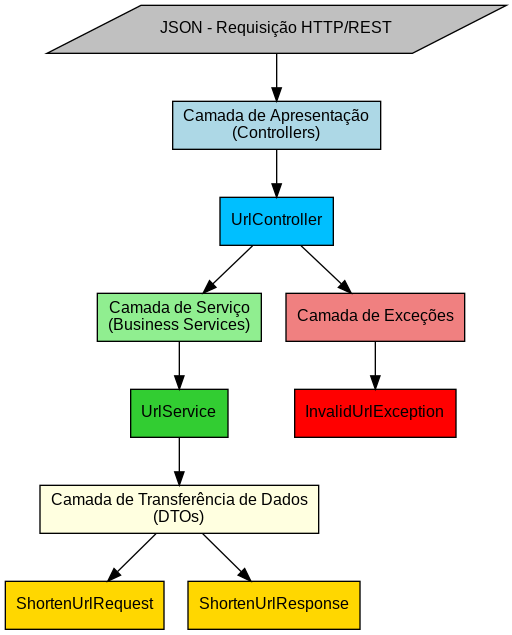
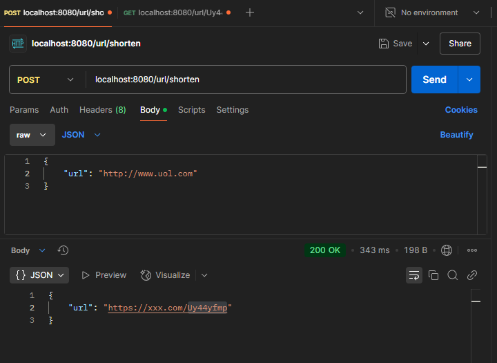
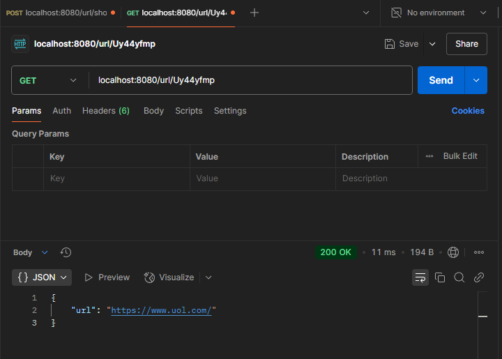
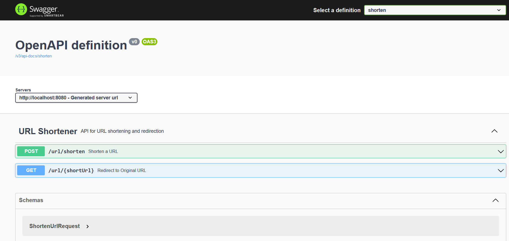

# URL Shortener API

Resolution of the Backend-br Challenge.

You can access the GitHub repository for this project here:
[URL-Shortener-Challenge](https://github.com/backend-br/desafios/blob/master/url-shortener/PROBLEM.md)

---

This is a REST API for shortening URLs and retrieving the original URLs based on a shortened identifier.

---

## Architecture Diagram

The project follows a layered architecture pattern, ensuring modularity and separation of concerns. The main layers include:

- **Presentation Layer**: Handles HTTP requests and responses, acting as the entry point for the API.
- **Service Layer**: Implements business logic and processes data before passing it between the controller and other layers.
- **Data Transfer Objects (DTOs)**: Defines structured objects to encapsulate data being sent and received.
- **Exception Handling Layer**: Centralized handling of application exceptions to ensure consistent error responses.


    


---

## Technologies Used

- Java 23
- Spring Boot 3
- Maven
- Lombok
- Swagger (OpenAPI)
- SLF4J (Logging)

---

## Project Structure


---

## API Endpoints

### URL Shortener Controller (`/url`)

#### **Determine Eligible Loans**
```http
POST /url/shorten
```
**Request Body:**
```json
{
  "url": "https://www.uol.com"
}
```
**Responses:**
- `200 OK` - Successfully shortened the URL
- `400 Bad Request` - Invalid URL provided
- `500 Internal Server Error` - Internal API error

**Example Response:**
```json
{
  "url": "https://xxx.com/AupUmVHT"
}
```

**Retrieve Original URL:**

```http
GET /url/{shortUrl}
```
**Path Parameter:**

`shortUrl` (string) - The shortened URL identifier

**Responses:**
- `200 OK` - Successfully retrieved the original URL
- `400 Bad Request` -  Shortened URL not found
- `500 Internal Server Error` - Internal API error

**Response Body:**
```json
{
  "url": "https://www.uol.com"
}
```

**Request - Using Postman**



**Response - Using Postman**




---

## Running the Application

### Prerequisites
Ensure you have the following installed:
- Java 23
- Maven
- Lombok

### Build and Run
```sh
mvn clean install
mvn spring-boot:run
```

The application will start on `http://localhost:8080`.

---

## Swagger Documentation

The API documentation is available at:

`http://localhost:8080/swagger-ui/index.html`

<br>



```

